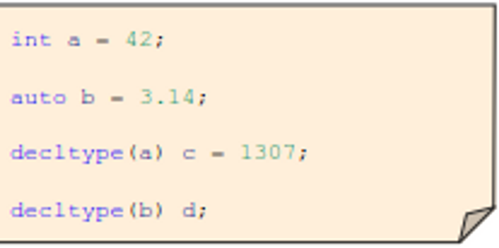
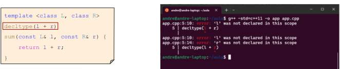
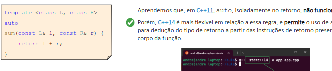

# Dedução e inspeção de tipos
## Dedução do tipo auto

As palavras chaves auto de decltype também deixam a cargo do compilador a tarefa de definir p tipo das variáveis declaradas no código. Essas palavras faz com que os programadores evitem de se preocupar com os tipos das variáveis assim como em linguagens de programação modernas.

→ O auto é uma espécie de “coringa”  que substitui a declaração explícita do tipo. Necessário declarar a variável inicializando-a.

## Decltype

O deccltype funciona como um método de inspeção de tipo diferente do auto que deduz um tipo a partir de uma expressão de inicialização. Dado um nome ou expressão, o decltype informa o tipo desse nome ou expressão.



Ao contrário com o que acontece para o template e auto, o decltype repete o tipo exato do nome ou expressão que se passa para ele.





## Exercício
 - Descrição do código a seguir : 
 ``` c++
#include <iostream>
#include <string>
#include <vector>
#include <map>
#include <cmath>

double distancia(const std::pair<double, double>& orig, const std::pair<double, double>& dest) {
    const double R = 6371.0; // raio médio da Terra em Km
    const double PI = 3.14159265; // constante PI
    double lat1_rad = orig.first * PI / 180.0;
    double lat2_rad = dest.first * PI / 180.0;
    double lon1_rad = orig.second * PI / 180.0;
    double lon2_rad = dest.second * PI / 180.0;
    double delta_lat = lat2_rad - lat1_rad;
    double delta_lon = lon2_rad - lon1_rad;
    double h = std::pow(std::sin(delta_lat / 2.0), 2.0)
    + std::cos(lat1_rad) * std::cos(lat2_rad) * std::pow(std::sin(delta_lon / 2.0), 2.0);
    double d = 2.0 * R * std::asin(std::pow(h, 0.5));
    return d;
}

int main() {
    std::map<std::string, std::vector<std::pair<double, double>>> roteiros = {
    {"Estrada Real (MG)", {
        {-20.387058648132697, -43.50276489546531},
        {-21.110096884824063, -44.17400882389444},
        {-21.135392099979775, -44.26168702763076},
        {-23.219718444240385, -44.71541419792069}}},
        {"Caminho dos Príncipes (SC)", {
        {-26.45903196178978, -48.60186925577256},
        {-26.484889252846987, -49.08265794057286},
        {-26.301589093945626, -48.84812743826987}}},
        {"Serra Gaúcha (RS)", {
        {-29.165328627526332, -51.51579840115089},
        {-29.363757873430096, -50.81285822760663},
        {-29.377433015152402, -50.87455594332935},
        {-28.74764895560134, -50.065278332356094}}}};
    for (std::map<std::string, std::vector<std::pair<double, double>>>::const_iterator it = roteiros.begin();
    it != roteiros.end(); ++it) {
        const std::string &nome = it->first;
        const std::vector<std::pair<double, double>> &rota = it->second;
        double distancia_total = 0.0;
        std::vector<std::pair<double, double>>::const_iterator origem = rota.begin();
        std::vector<std::pair<double, double>>::const_iterator destino = ++rota.begin();
        while (destino != rota.end()) {
            double d = distancia(*origem, *destino);
            distancia_total += d;
            ++origem;
            ++destino;
        }
        std::cout << nome << ": " << distancia_total << " Km" << std::endl;
    }
    return 0;
}
 ```

 O código possui uma função de distância responsável por calcular a distância entre dois pontos goegráficos com base em sua latitude e longitude. Para tanto, ele utiliza dos valores de PI e o raio medio da terra a fim de realizar o cálculo. Assim, essa função recebe como parâmetros as duas coordenadas e retorna um valor double, da distância em km.
No escopo principal, cria-se um map nomeado de "Roteiros" e depois calcula a distância entre os pontos passados em cada rota e, ao final, calcula a distância total da rota.

### Defina e diferencie os conceitos de dedução automática de tipo (implementado através de auto) e a inspeção automática de tipo (implementada através de decltype).

A dedução de tipo implementada pelo auto funciona como um "coringa" sendo capaz de subtituir a declaração explícita do tipo. O responsável por realizar essa dedução é o compilador a partir do tipo de retorno à direita ou o tipo de expressão de retorno de uma função. Assim, é necessário a inicialização da variável quando esta é declarada como auto.

Já o decltype ao contrário do que acontece durante o processo de dedução de tipo para template e auto, essa expressão geralmente repete o tipo do nome ou expressão que se passa por ele,por isso o nome inspeção de tipo. A principal motivação para a criação dessa inspeção é a programação genérica em que é comum especificarmos tipos a partir de expressões.

### O que é uma declaração estruturada? Apresente um exemplo de uso desse tipo de declaração

A declaração estruturada é uma sintáxe de inicialização de variáveis em c++, que permite a incializar várias variáveis de uma só vez. por exemplo:
```C++
auto a = std::array<int, 3>{1, 2, 3};
```

###  Por que variáveis declaradas com decltype não têm a obrigatoriedade de serem inicializadas na declaração?
O decltype é responsável por ispecionar o tipo da variável ou expressão passada e determinar para uma nova variável esse mesmo tipo. Sendo assim, não se torna necessária a inicialização pois o compilador já sabe a quantidade de memória a ser alocada a partir do tipo ispecionado.

### Onde decltype(auto) é utilizado e qual a sua semântica?

Introduzido no C++14, a ideia do decltype(auto) é: Auto indica que ocorre uma dedução de tipo por alguma expressão contextual e o dcltype indica que a dedução deve seguir as regras de decltype, e não as regras de dedução de auto.
```C++
template<class Container>
decltype(auto) get_elemento(Container& c, std::size_t idx){
    return c[idx]
}
```
Como o decltype inspeciona o tipo de c[inx], o retorno é o desejado ou seja, int&.

### O C++98/03 apresenta um recurso similar a inspeção automática de tipo, inicialmente implementada pelo compilador G++. Diga qual é esse recurso e apresente um exemplo de uso.

O recurso similar é o typeof(x) permitindo determinar o tipo em tempo de compilação.
``` C++
typeof( expressao ) nome_variavel;
```
Em que "expressao" é o tipo que se deseja determinar e "nome_variavel" é o nome da variável a ser declarada com o tipo da expressão. A seguir, tem-se um exemplo desse uso:

``` C++
#include <iostream>
using namespace std;

int main() {
    int x = 5;
    typeof(x) y = x * 2; // y é declarado como int
    cout << y << endl; // saída: 10
    return 0;
}
```